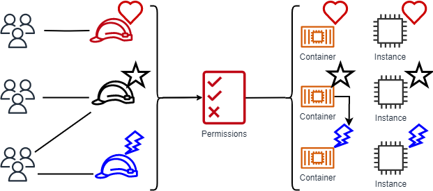

# A Terraform Module for Configuring ABAC in the AWS IAM Identity Center

From the [AWS IAM User Guide](https://docs.aws.amazon.com/IAM/latest/UserGuide/introduction_attribute-based-access-control.html):
> Attribute-based access control (ABAC) is an authorization strategy that defines permissions based on attributes. AWS calls these attributes tags. You can attach tags to IAM resources, including IAM entities (IAM users or IAM roles) and to AWS resources. You can create a single ABAC policy or small set of policies for your IAM principals. You can design ABAC policies that allow operations when the principal's tag matches the resource tag. ABAC's attribute system that provides both high user context and granular access control. Because ABAC is attribute-based, it can perform dynamic authorization for data or applications that grants or revokes access in real time. ABAC is helpful in environments that are scaling and in situations where identity or resource policy management has become complex.
> For example, you can create three IAM roles with the access-project tag key. Set the tag value of the first IAM role to Heart, the second to Star, and the third to Lightning. You can then use a single policy that allows access when the IAM role and the AWS resource have the tag value access-project.
> 


These Terraform modules will enable ABAC within your IAM Identity Center instance. You can adjust
the attributes to suit your needs. If you, instead, wish to enable and configure attributes for
access control using the IAM Identity Center console or IAM Identity Center API, you can follow
this [guide](https://docs.aws.amazon.com/singlesignon/latest/userguide/configure-abac.html).

```hcl
module "abac_attributes" {
  source     = "../../modules/abac-attributes"
  attributes = {
    "CostCenter"   = "$${path:enterprise.costCenter}"
    "Organization" = "$${path:enterprise.organization}"
    "Division"     = "$${path:enterprise.division}"
  }
}

module "abac_permissions" {
  source              = "../../modules/abac-permissions"
  permission_set_name = "EC2AllowAccessEngineers"
  principal_name      = "MyPrincipalName"
  principal_type      = "GROUP"
  account_identifiers = ["123456789012"]
  attributes          = module.abac_attributes.attributes

  actions_readonly = [
    "ec2:DescribeInstances",
  ]

  actions_conditional = [
    "ec2:StartInstances",
    "ec2:StopInstances"
  ]
}
```

<!-- With this module, you should be able to create a new project that:
* Contains all permission sets for a given project
* Defines individual permission sets as inline policies
* Replicates or defines customer policies
* Includes a variable for a tag/attribute that will only allows access to resources with same tag -->

<!-- ## Considerations
* Customise inline policies to attach to users or groups and filter through them.
* Implement ABAC in other services and resources:
    * Resources like EC2 instances. Could potentially try an S3 bucket again.
    * Automate that process for creating and applying the role. 
    * Tag the roles and users.
* Check if actions could be a wildcard or if you have to specify the actions.
For example, could you use `[*]` instead of something like `ec2:ListInstances`.
* Check if roles have to be given tags manually or if they can be automatically
applied whenever a new SSO instance is given. -->

<!-- > **NOTE:**
> When working with IAM Identity Center and Terraform State, always have an admin account 
> assigned to the management account outside of that Terraform State, in case you
> make the mistake of removing all access. If pushing a change altering or 
> going near admin permission sets and the management account push it from 
> another user, or use a use/role with keys. -->
